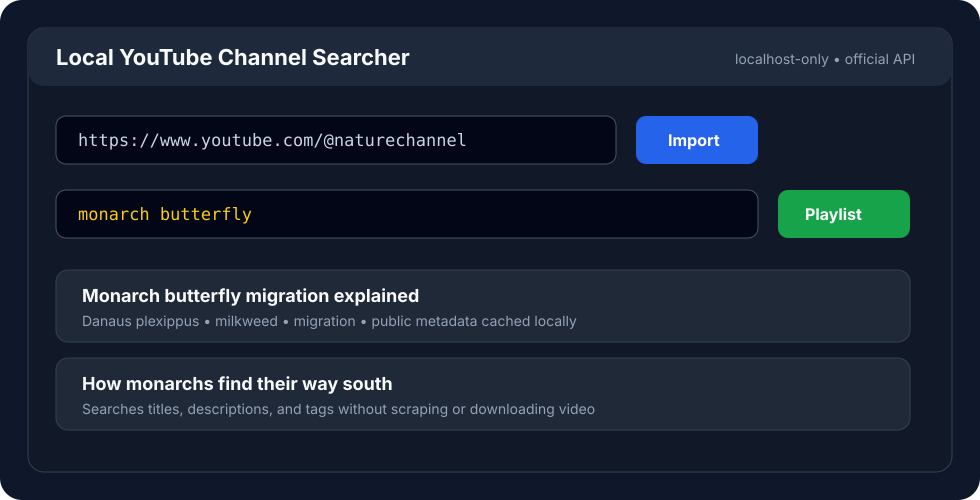

# YouTube Channel Searcher and Playlist Maker

[](https://github.com/DiscoStew6082/youtube-channel-searcher-and-playlist-maker/actions/workflows/ci.yml)

A local-first web app that indexes one YouTube channel's public metadata with the official YouTube Data API, then lets you search that channel by species name, common name, scientific name, or any other keyword.

## 30-second proof

- **Problem:** YouTube channel search is weak when you remember a topic, species, or phrase but not the exact video title.
- **System:** FastAPI app imports a channel's public video metadata, stores it locally in SQLite, and searches titles, descriptions, and tags without scraping or downloading video.
- **Workflow:** search locally, inspect matching videos, then generate a temporary YouTube queue from the result set.
- **Privacy boundary:** no YouTube account access, no captions/transcripts, no video downloads, loopback-only hosts, API key kept in local `.env`, remote thumbnails off by default.
- **Stack:** Python, FastAPI, Jinja, SQLite, httpx, uv, pytest, GitHub Actions, CodeQL.

**Recruiter signal:** this is a small but complete local-first product surface: external API integration, privacy-conscious storage, tested parsing/search logic, and a usable browser workflow.



It is built for the annoying moment when you know a channel talked about dolphins, hyenas, milkweed, or some obscure species, but YouTube's own channel search is not helping.

## What It Does

- Imports public metadata from one YouTube channel.
- Searches video titles, descriptions, and tags locally.
- Shows clickable results with dates, snippets, YouTube links, and optional remote thumbnails.
- Creates a temporary playlist-style YouTube queue from any search term.
- Runs in dark mode.
- Shuts itself down after an idle timeout.
- Keeps your indexed data on your own machine.

## Privacy and Legality

This app is intentionally conservative:

- It uses the official YouTube Data API.
- It does not scrape YouTube pages.
- It does not download videos.
- It does not fetch captions or transcripts.
- It does not require access to your YouTube account.
- It stores the API key in a local `.env` file that should never be committed.
- It does not load YouTube-hosted thumbnails unless `ALLOW_REMOTE_THUMBNAILS=true` is explicitly configured.

Each user should create and use their own YouTube Data API key.

## Quick Start

Create a `.env` file:

```bash
cp .env.example .env
```

Add your YouTube Data API key:

```bash
YOUTUBE_API_KEY=your_key_here
DATABASE_PATH=./data/youtube_species.db
IDLE_SHUTDOWN_SECONDS=30
ALLOW_REMOTE_THUMBNAILS=false
```

Install the exact locked dependencies with [uv](https://docs.astral.sh/uv/):

```bash
uv sync --locked --all-groups
```

Run the app locally:

```bash
uv run --locked uvicorn app.main:app --host 127.0.0.1 --port 8000
```

Open:

```text
http://127.0.0.1:8000
```

## Basic Workflow

1. Paste a YouTube channel URL.
2. Click **Import Channel**.
3. Search for a species name or keyword.
4. Click a video result, or click **Create Playlist** to build a temporary queue from the search results.

## Security Notes

Run the app on localhost:

```bash
--host 127.0.0.1
```

Avoid exposing it to your network with `--host 0.0.0.0`. The application also rejects non-loopback `Host` headers, cross-site browser requests, and state-changing forms without its per-process CSRF token.

The app auto-shuts down after `IDLE_SHUTDOWN_SECONDS` with no browser activity. Set it to `0` to disable idle shutdown.

Remote thumbnails are disabled by default so local searches do not trigger image requests to YouTube. Setting `ALLOW_REMOTE_THUMBNAILS=true` opts into those requests; YouTube will receive the machine's IP address and the requested video IDs. Referrer information is still suppressed.

## Security Checks

CI installs from the committed `uv.lock`, runs the test suite and Bandit, audits the complete locked dependency set with `pip-audit`, and runs CodeQL's extended Python security queries. Dependabot monitors both Python and GitHub Actions dependencies.

## Project Status

Early personal-tool prototype. Useful today, intentionally small, and designed to stay local-first.

## Not Affiliated

This project is not affiliated with YouTube or Google.
